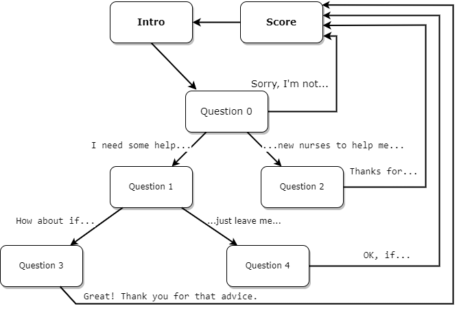
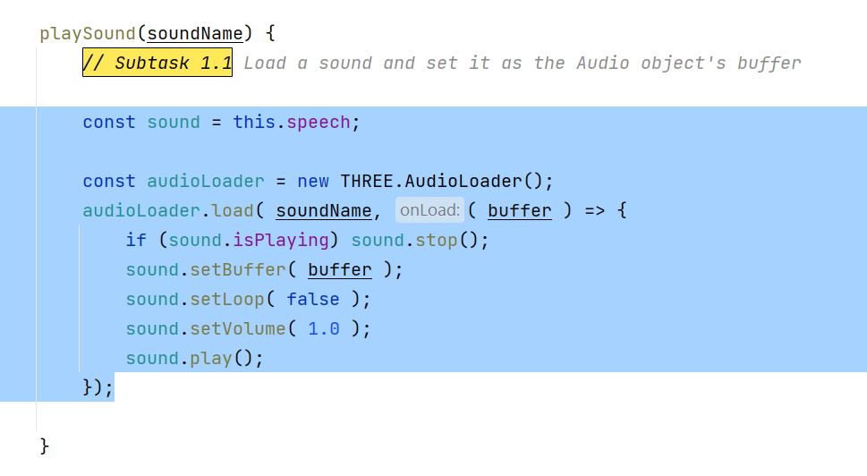
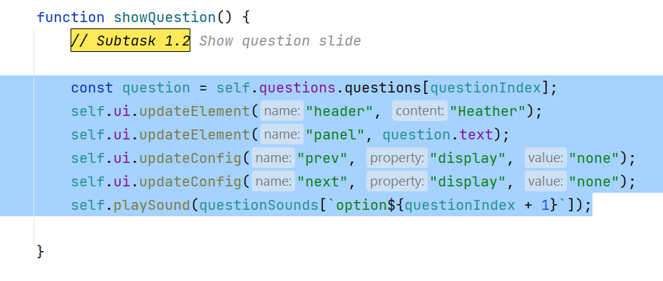
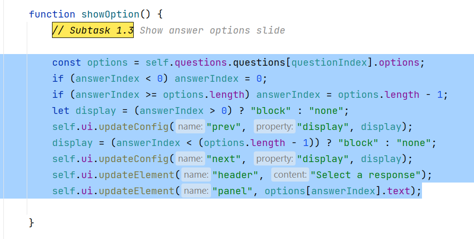
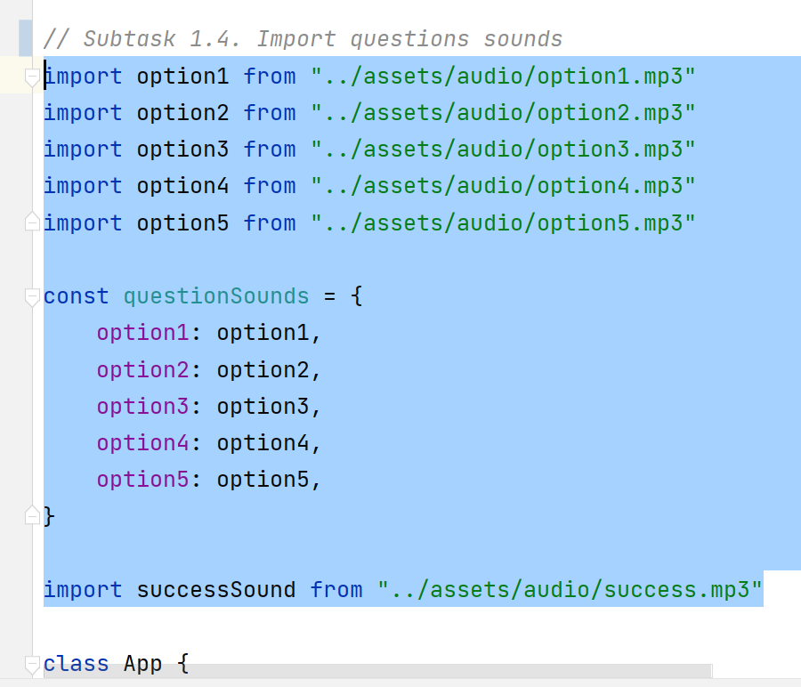
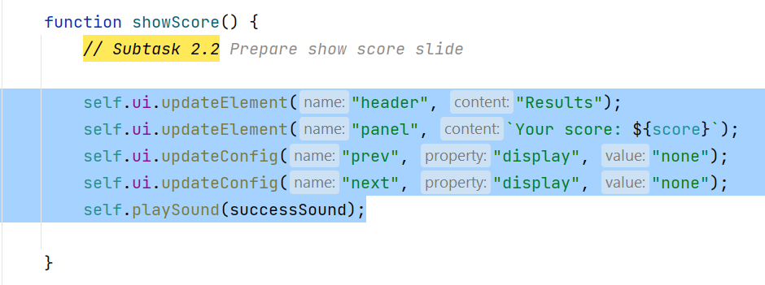
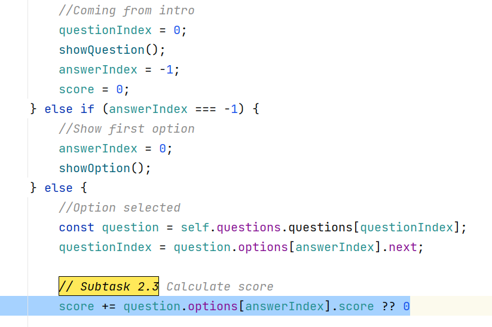
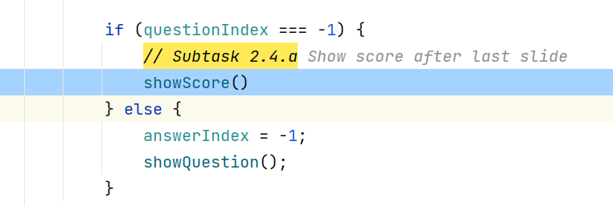
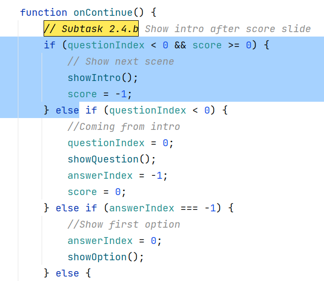

# VR Train

The immersive experience puts the student in as close
to a real environment as possible without it actually
being dangerous

## Questions link diagram

## Task 1. Add scenario using speech and CanvasUI

### Subtask 1.1 Load a sound and set it as the Audio object's buffer

### Subtask 1.2 Show question slide

### Subtask 1.3 Show answer options slide

### Subtask 1.4 Import sound files

## Task 2. Calculate score

### Subtask 2.1 Calculate score

### Subtask 2.2 Prepare show score slide

### Subtask 2.3 Calculate score

### Subtask 2.4 Show results with score slide

### Subtask 2.4.a Show score after last slide

### Subtask 2.4.b Show `Intro` after score slide

## Task 3. Find next question based on its `ID` instead of array index

## Task 4. Add new dialog

For example, you could request to the GPT chat with query:
__"Example dialog with optional answers and score for an educational quiz in VR"__

#### Resources

Models:
- https://kenney.nl/assets?q=3d
- https://quaternius.com
- https://www.cgtrader.com/
- https://www.turbosquid.com/
- https://free3d.com/3d-models/
- https://www.mixamo.com/

Audio:
- https://mixkit.co/free-sound-effects/game/
- https://elements.envato.com/sound-effects

### Github repository with useful links

[https://github.com/it-zmina/vr-info/blob/main/WEB-VR.md](https://github.com/it-zmina/vr-info/blob/main/WEB-VR.md)